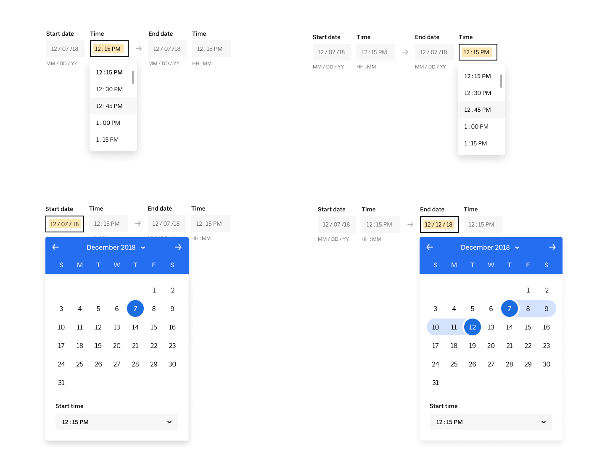

# baseui/datepicker

This is a proposal for enhancements to the existing collection of datepicker components.

## Motivation

Date/time selections need more precision than a single date or range of dates (what is currently implemented). This proposal outlines two new components and changes to one existing component. `TimePicker`, `TimezonePicker`, and `DatePicker`.

## APIs and Components

`TimePicker` - used to select a time, decoupled from a date. E.g. `11:50AM`.

API:

* `format?`: `24h | 12h` Renders dropdown labels in AM/PM 12 hour format or 24 hour. Defaults to 12h.
* `step?`: `number` Range from 1 - 3600. 900 default (15 minutes). For now, values between whole 'minutes' will round up to nearest minute.
* `value?`: `number` Value from 0 - 86400.
* `onChange?`: `(number) => mixed`

`TimezonePicker` - used to select a timezone. E.g. `America/Los_Angeles` as determined by the [IANA database](https://www.iana.org/time-zones).

API:

* `date`: `Date` Determines if the options should include standard or daylight timezones.
* `mapLabels`: `(Option) => string` Use this function to modify the displayed timezone labels. For example, map `America/Los_Angeles` to `Pacific Time`.
* `onChange`: `(Option) => mixed` Callback for when the selection changes.
* `value`: `Array<{id: string}>` Based on Select component value prop.

`DatePicker` - used to select a date. Already implemented.

Updated API:

* `duplex`: `boolean` Renders two calendars side-by-side.
* `quickSelectOptions`: `Array<{label: string, value: Date[]}>` An array of label plus date range combinations that will be displayed in a dropdown menu. Overwrites the default set of quick-select options.
* `onTimeChange`: `(number | number[]) => mixed` Called when time select is changed. Calls back with an array if duplex calendar.
* `timeFormat?`: `24h | 12h` Renders dropdown labels in AM/PM 12 hour format or 24 hour. Defaults to 12h.
* `timeStep?`: `number` Range from 1 - 60. null default. If provided, will display a dropdown menu underneath the calendar. If calendar is displayed as duplex, two time select dropdowns will be displayed; one for start time, and another for end time.
* `overrides`: Removes the `QuickSelectContainer`, `QuickSelectLabel`, and `QuickSelectButton` overrides.

## Component Examples

```js
import * as React from 'react';
import {Datepicker, Timepicker, TimezonePicker} from 'baseui/datepicker';

function DatepickerCustomQuickSelect() {
  return (
    <Datepicker
      quickSelectOptions={[{
        label: 'Last two days',
        value: [subtractByDays(new Date(), 2), new Date()],
      }]}
      quickSelect
      range
    />
  );
}

function DatepickerTimeSelect() {
  return <Datepicker timePrecisionInMinutes={10} />;
}

function TimePickerAtPrecision() {
  return <Timepicker precisionInMinutes={30} />;
}

function TimezonePickerWithDate() {
  return <TimezonePicker date={new Date(2019, 3, 1)} />;
}

function TimezonePickerCustomLabel() {
  return (
    <TimezonePicker
      mapLabels={option => {
        // where option.id is the IANA title
        return IANATitleToLocalizedName[option.id];
      }}
    />
  );
}
```

## Extended Example

The code below should render this component:



```js
import React, {useState} from 'react';
import ArrowRight from 'baseui/icon/arrow-right';
import {FormControl} from 'baseui/form-control';
import {Datepicker, Timepicker, TimezonePicker} from 'baseui/datepicker';

const TIME_PRECISION = 5;

function SelectRangeExample() {
  const [startDate, setStartDate] = useState(null);
  const [endDate, setEndDate] = useState(null);
  const [startTime, setStartTime] = useState(null);
  const [endTime, setEndTime] = useState(null);

  return (
    <FormControl label="Start Date">
      <DatePicker
        value={[startDate, endDate]}
        onChange={({value}) => {
          setStartDate(values[0])
          setEndDate(values[1])
        }}
        timePrecisionInMinutes={TIME_PRECISION}
        onTimeChange={setStartTime}
        range
      />
    </FormControl>

    <FormControl label="Start Time">
      <TimePicker
        value={startTime}
        onChange={setStartTime}
        timePrecisionInMinutes={TIME_PRECISION}
      />
    </FormControl>

    <ArrowRight />

    <FormControl label="End Date">
      <DatePicker
        value={[startDate, endDate]}
        onChange={({value}) => {
          setStartDate(values[0])
          setEndDate(values[1])
        }}
        timePrecisionInMinutes={TIME_PRECISION}
        onTimeChange={setEndTime}
        range
      />
    </FormControl>

    <FormControl label="End Time">
      <TimePicker
        value={endTime}
        onChange={setEndTime}
        timePrecisionInMinutes={TIME_PRECISION}
      />
    </FormControl>
  )
}
```
