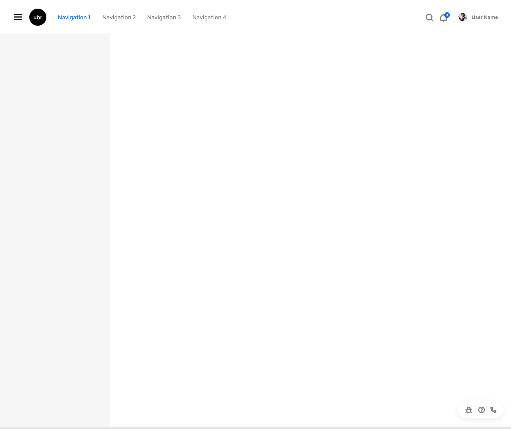
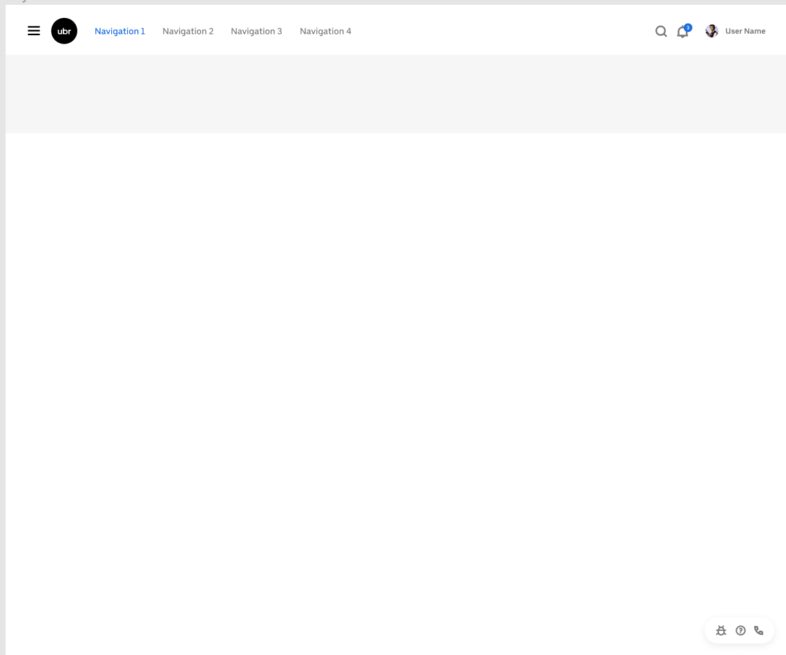
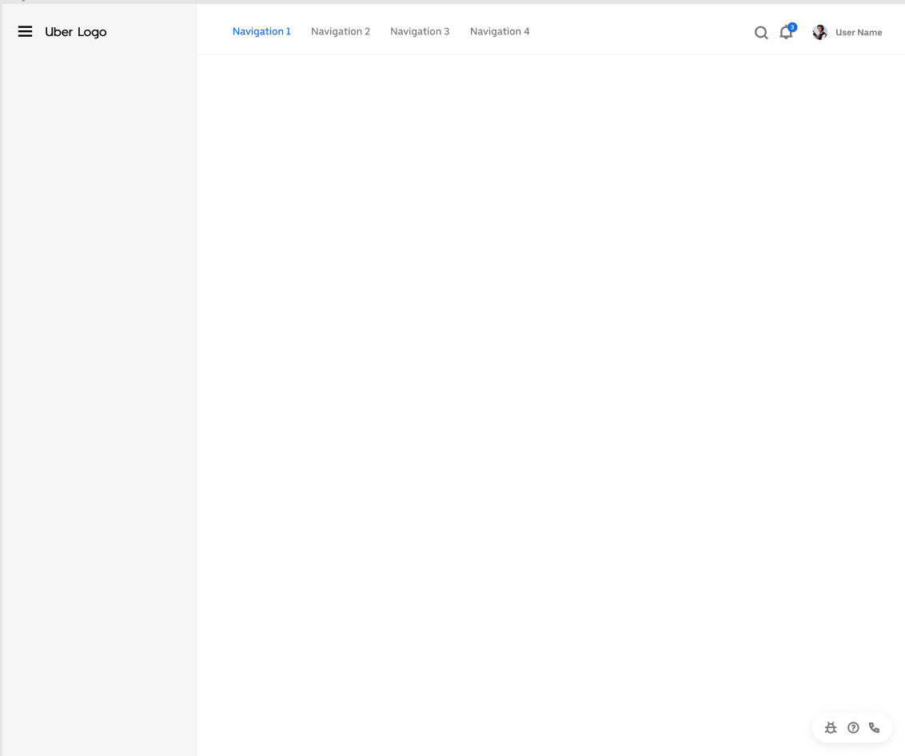

# Layout Component

## Usage

* `Layout`: The layout wrapper, can contain `Header`, `Sidebar`, `Content`, `Footer` or `Layout` itself,
* `Header`: The top layout, in which any element can be nested, and must be placed in `Layout`.
* `Sidebar`: The sidebar with default style and basic functions, in which any element can be nested, and must be placed in `Layout`.
* `Content`: The content layout, in which any element can be nested, and must be placed in `Layout`.
* `Footer`: The bottom layout, in which any element can be nested, and must be placed in `Layout`.

### Example layout 1



```javascript
import * as React from 'react';
import {Layout, Header, Sidebar, Content} from 'baseui/layout';

export default () => {
  return (
    <Layout>
      <Header fixed>Header content</Header>
      <Layout>
        <Sidebar>Menu placeholder</Sidebar>
        <Content>Main content placeholder</Content>
      </Layout>
    </Layout>
  );
};
```

### Example layout 2



```javascript
import * as React from 'react';
import {Layout, Header, Sidebar, Content} from 'baseui/layout';

export default () => {
  return (
    <Layout>
      <Header fixed>Header content</Header>
      <Layout>
        <Header fixed>Sub-Header content</Header>
        <Content>Main content placeholder</Content>
      </Layout>
    </Layout>
  );
};
```

### Example layout 3



```javascript
import * as React from 'react';
import {Layout, Header, Sidebar, Content} from 'baseui/layout';

export default () => {
  return (
    <Layout>
      <Header>Header content</Header>
      <Layout>
        <Sidebar collapsible>Menu content</Sidebar>
        <Content>Main content placeholder</Content>
      </Layout>
    </Layout>
  );
};
```
